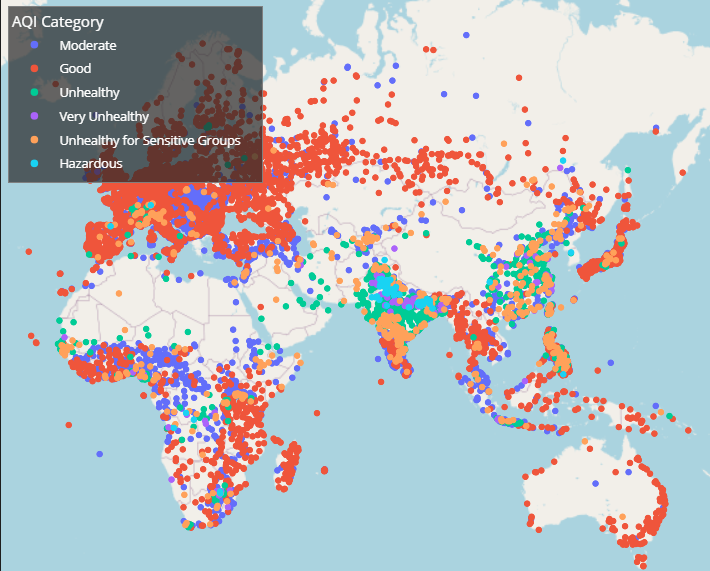
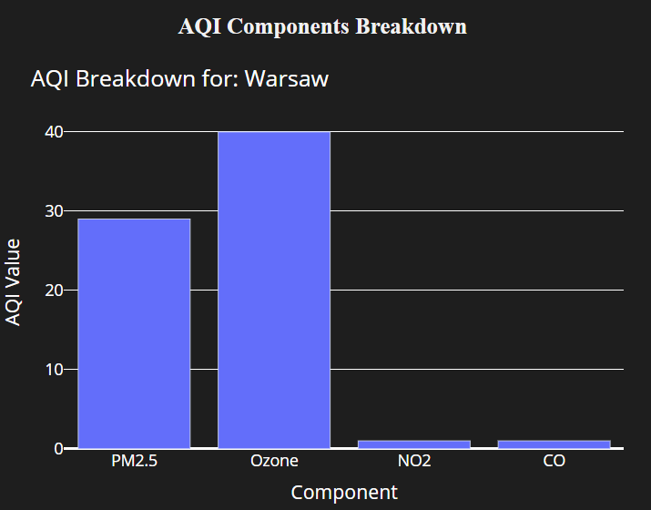

# 🌍 Global AQI Dashboard

An interactive Dash app that visualizes global **Air Quality Index (AQI)** data using a **map-based interface** and **component-level breakdowns**.

✅ Live version: [aqi-dash.onrender.com](https://aqi-dash.onrender.com)

---

## ✨ Features

- 📍 Interactive **scatter map** with AQI categories by city
- 📊 Detailed **bar chart** showing AQI components: PM2.5, Ozone, NO₂, CO
- 🌘 **Dark mode** UI for better visual contrast
- 📱 **Responsive layout** optimized for mobile and desktop
- 📌 Default breakdown shown for **Warsaw**
- 📁 Clean project structure, ready to deploy

---

## 📸 Screenshots

| Map with Legend | AQI Component Breakdown |
|-----------------|-------------------------|
|  |  |

---

## 🛠 Tech Stack

- [Dash](https://dash.plotly.com/)
- [Plotly](https://plotly.com/python/)
- [Pandas](https://pandas.pydata.org/)
- OpenStreetMap for base map rendering

---

## 🚀 Run Locally

```bash
git clone https://github.com/KustronBartlomiej/aqi-dash.git
cd aqi-dash
pip install -r requirements.txt
python mainDash.py
